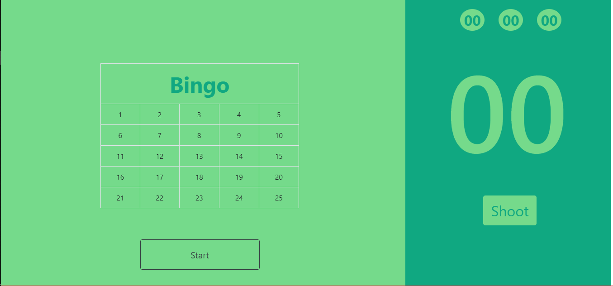

# Bingo
This repository contains a simple game with dedicated UI and UX. It is completely built on JQuery.

## Technology Stack

* HTML
* CSS
* JQuery

## Description
   The initial window is provided with 5*5 table.Users need to fill some random numbers in that table cells.When user click on start a timer on left end of the window starts.User need to click on the shoot button which provides some random number from the inputs that user given in table.Then the particular cell matching the random number will be highlighted.If a row or column or diagonal highlighted then user can click on Bingo.So that the timing constraint is that which determines the winner if two or more players were playing.

